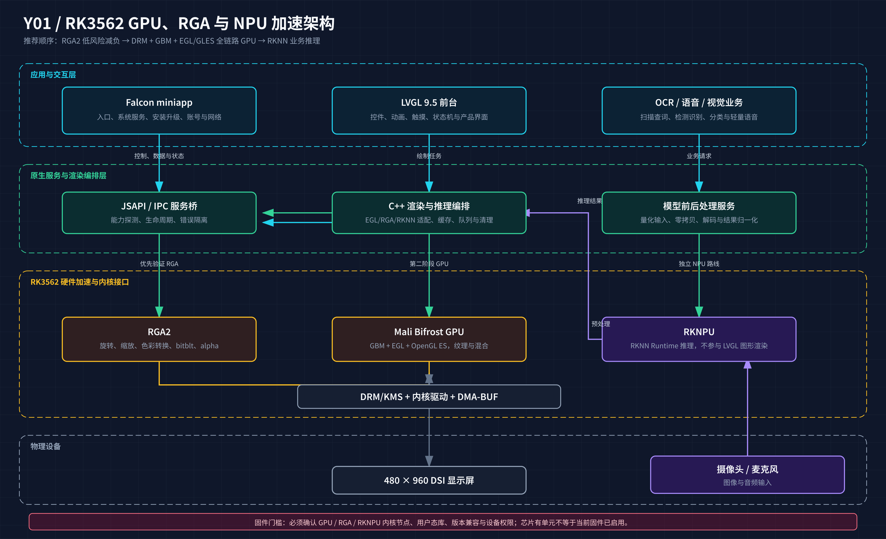

# RK3562 GPU / RGA / NPU 与 LVGL 加速调研报告

> 调研日期：2026-08-06  
> 目标设备画像：有道 Y01，`OVERHEAD_Y01_SKU_CHN_PRO`，固件 4.8.6，RK3562/AArch64，Buildroot Linux 5.10.160，480×960 DSI 面板  
> 项目基线：LVGL 9.5.0，当前为自定义 DRM/KMS + 软件绘制 + 双缓冲

## 一、结论摘要

这颗 RK3562 从芯片和开源软件栈看，具备三类可利用的硬件能力：

1. Mali Bifrost GPU：适合把 LVGL 的填充、纹理、透明混合、图片和动画绘制迁移到 OpenGL ES。
2. RGA2：独立 2D 加速器，适合先搬走当前代码中的 270°旋转、缩放、色彩转换、bitblt 和 alpha 混合。
3. RKNPU：独立神经网络加速器，适合 OCR 检测/识别、图像分类、轻量目标检测、语音特征或发音评分模型；它不参与 LVGL 控件渲染。

对当前工程，推荐顺序是：

**先做 RGA2 旋转减负，再做 DRM + GBM + EGL/GLES 的 GPU 路线，最后把 RKNPU 接到扫描和语音业务。**

原因是当前 LVGL 已稳定跑到约 40.6 FPS，CPU 平均约 43.1% 的一个核心；直接重写整条显示链路的风险高，而 RGA2 可以保持现有 LVGL 和 DRM 接口，只替换最后的像素搬运阶段。

本次已接入一台 RK3562 定制 Linux 板进行只读探测。ADB 枚举仍显示 `product:occam / model:Nexus_4`，但内核为 `5.10.160 aarch64`，设备树型号为 `Rockchip RK3562 ORANGE LP4 V10 Board`，因此不能再把 ADB 型号字段当作产品型号证据。

真机结果已经改变了 GPU 判断：`/sys/firmware/devicetree/base/gpu@ff320000/status` 为 `disabled`；未发现 `/dev/mali*`、Mali/Panfrost 驱动、`libEGL.so`、`libGLES*.so` 或 `libgbm.so`。因此当前固件不能直接创建 OpenGL ES/EGL context，打开 LVGL 的 `LV_USE_OPENGLES` 宏也不会解决问题。另一方面，`/dev/rga`、`librga.so.2.1.0`（RGA API 1.9.2）存在，RKNPU 设备树状态为 `okay`、DRM 节点由 `RKNPU` 驱动接管，且 `librknnrt.so` 与 `rknn_server` 存在。

## 二、证据分级

| 能力 | 芯片/上游证据 | 当前连接固件状态 | 判断 |
|---|---|---|---|
| GPU | RK3562 上游设备树含 `gpu@ff320000`，兼容串为 `arm,mali-bifrost` | GPU 节点为 `disabled`；无 `/dev/mali*`、Mali/Panfrost、EGL/GLES/GBM 用户态库 | 当前固件不可用 OpenGL ES；需先启用并匹配整套 GPU 栈 |
| RGA2 | 上游设备树含 `rga@ff440000`，兼容串为 `rockchip,rga2_core0` | `/dev/rga` 存在，`librga.so.2.1.0` 存在，API 版本 1.9.2 | 可以立即做旋转/缩放 PoC |
| NPU | 上游设备树含 `npu@ff300000`，兼容串为 `rockchip,rk3562-rknpu` | 节点为 `okay`，`card1/renderD129` 由 `RKNPU` 驱动接管，`librknnrt.so`、`rknn_server` 存在 | 可以独立接入 RKNN 推理 |
| LVGL OpenGL ES | LVGL 9.5 文档提供 DRM + GBM + EGL/GLES 和 OpenGL draw unit | 当前 `lv_conf.h` 使用软件绘制，`LV_USE_OPENGLES=0` | 软件路径可保留，GPU 路线可增量验证 |
| Falcon 共存 | 当前启动器已能从 Falcon 入口切换到全屏 LVGL 并恢复 Falcon | 同帧嵌入仍无公开 Surface/纹理接口 | 推荐“miniapp 外壳 + LVGL 前台 + 原生服务桥” |

## 三、当前显示链路的可优化位置

当前应用的 LVGL 逻辑画布是 960×266，物理面板是 480×960。`DrmBackend::present_logical()` 在 CPU 上完成逻辑画布到物理 dumb buffer 的旋转、偏移和像素复制，然后提交 KMS page flip。

这条链路可以拆成：

```text
LVGL 软件绘制  →  960×266 逻辑帧
             →  270°旋转 + x/y 偏移 + 格式/stride 处理
             →  480×960 DRM buffer
             →  KMS page flip
```

因此即使不改变 LVGL 控件和页面代码，也可以先让 RGA2 接管中间的旋转/复制，再评估 CPU 和帧时间变化。GPU 路线则应把 LVGL 的绘制目标改为 GBM/EGL 可用的 GPU buffer，并用 GLES 合成最终的旋转和裁剪结果。



## 四、GPU 路线

### 4.1 LVGL 9.5 已有的接入方式

LVGL 9.5 的 Linux DRM 文档给出了两条显示缓冲路径：

- dumb buffer：简单、依赖少，适合当前 PoC；
- GBM buffer：由 `libgbm` 分配 GPU 友好的 buffer。

在 DRM 之上启用 EGL/GLES 时，LVGL 可自动初始化 EGL；启用 `LV_USE_DRAW_OPENGLES` 后，OpenGL draw unit 可以处理填充、边框、阴影、文字、弧线、线条、三角形和图片等绘制任务，并利用纹理缓存和 GPU 混合。

候选配置如下：

```c
#define LV_USE_LINUX_DRM             1
#define LV_USE_LINUX_DRM_GBM_BUFFERS 1
#define LV_USE_OPENGLES              1
#define LV_USE_DRAW_OPENGLES         1
#define LV_DRAW_OPENGLES_TEXTURE_CACHE_COUNT 64
```

这不是把几项宏打开就完成。当前连接固件还缺少 GPU 栈，必须先满足：

- 内核启用 GPU 驱动，且存在可访问的 `/dev/dri/renderD*` 或厂商 Mali 节点；
- 固件提供与内核驱动匹配的 `libEGL.so`、`libGLESv2.so`、`libgbm.so`；
- AArch64/glibc 版本与现有交叉工具链兼容；
- DRM master、GBM buffer、EGL context 和 Falcon 的显示所有权能够正确交接。

**当前结论：OpenGL ES 暂不可用。** 需要在 Buildroot/板级 DTS 中将 `gpu@ff320000` 设为 `okay`，加入与 5.10.160 内核匹配的 Mali 用户态驱动、EGL/GLES 和 GBM，再用 `eglinfo` 或最小 EGL 程序验证；在此之前，LVGL 应继续使用现有软件绘制，优先接入 RGA2。

### 4.2 Y01 需要特别处理的旋转问题

LVGL 的标准 DRM+EGL 示例默认把内容直接送到首选显示模式，而 Y01 的产品逻辑是旋转后的 960×266 画布叠加到 480×960 面板的可见区域。建议二选一：

**方案 A：GPU 最终合成。** LVGL 在 960×266 的 EGL surface/texture 中绘制，使用一个简单 GLES shader 将纹理旋转 270°、偏移到物理画布，再输出到 GBM/KMS surface。这样最接近现有坐标契约。

**方案 B：KMS plane 旋转。** 如果真实 primary/overlay plane 暴露 `rotation`、`alpha`、`zpos` 和合适的 source/destination rectangle，可让 KMS 处理旋转，LVGL 只绘制逻辑 buffer。必须以 `modetest` 和实际画面为准，不能从芯片型号推断 plane 属性。

不建议第一步把 EGL 绘制后再 `glReadPixels()` 回 CPU dumb buffer；这样会引入 GPU→CPU 同步，可能抵消加速收益。

### 4.3 GPU 能带来的实际收益

- 多层透明、渐变、圆角和图片合成更适合 GPU；
- 纹理缓存可以降低静态卡片、图标和背景重复绘制成本；
- 页面切换、缩放、淡入淡出和图片动画更容易保持稳定帧率；
- 不能假设所有动态内容都变快。LVGL 文档明确指出，持续每帧变化的内容可能仍接近软件绘制，因为纹理缓存无法复用。

### 4.4 GPU 的主要风险

- Y01 固件可能只有厂商闭源 Mali 用户态，或者根本没有暴露 EGL/GBM；
- 供应商库、内核驱动和 GPU 节点必须版本匹配；
- 当前 Falcon/miniapp 与 LVGL 的显示所有权切换仍需由 supervisor 管理；
- GPU 合成并不会自动解决触摸坐标、字体授权、业务服务和功耗问题；
- GPU 与 NPU/RGA 同时工作时会共享内存带宽，必须测量热和功耗。

## 五、RGA2 路线：建议最先验证

RGA 是独立 2D 硬件加速器，官方 `librga`/IM2D API 提供 `imrotate`、`imresize`、`imflip`、`imblend`、`improcess`、`importbuffer_fd` 和 `wrapbuffer_fd` 等能力，并把 RK3562 列为适用平台。

### 5.1 对当前代码的最小改造

1. 保留 LVGL 软件绘制和现有 960×266 逻辑帧。
2. 从 DRM buffer 导出 DMA-BUF fd，或确认 dumb buffer 可由 RGA 直接导入。
3. 用 `wrapbuffer_virtualaddr`/`importbuffer_fd` 描述源和目标图像。
4. 用 `imrotate` 完成 270°旋转，再用 destination rectangle 表达 Y01 的物理偏移。
5. 用 `imcheck` 先检查格式、stride、对齐和硬件支持，再提交任务。
6. 以现有软件版本为基线，比较 `present_logical()` 的平均/峰值耗时、CPU、FPS、RSS 和温度。

### 5.2 为什么它适合作为第一步

RGA 不改变 LVGL 的绘制 API，也不要求先建立 EGL context。即使 RGA 不可用，也可以保留软件 fallback；即使收益有限，实验仍能确认 DMA-BUF、格式和 KMS buffer 的硬件契约，为后续 GPU/NPU 共用 buffer 做准备。

## 六、NPU 路线

### 6.1 NPU 不负责画界面

RKNPU 的工作是张量推理，不是 LVGL 的控件渲染。不要把“启用 NPU”理解成“LVGL FPS 自动提高”。合理的组合是：

```text
摄像头帧
  → RGA resize / rotate / color convert
  → RKNPU OCR / detection / classification
  → CPU 后处理、词典查询或音频服务
  → LVGL 显示识别框、结果和动画
```

### 6.2 官方软件栈与模型范围

Rockchip 官方 RKNN Toolkit2 文档明确把 RK3562 列入支持平台，并将流程分为：PC 端模型转换/量化、板端 RKNN Runtime C/C++ 推理。RKNPU2 API 提供 `rknn_init`、`rknn_query`、`rknn_inputs_set`、`rknn_run`、`rknn_outputs_get`，并支持查询 API/driver 版本、外部内存和零拷贝相关接口。

官方 RKNN Model Zoo 的 RK3562 列表已经覆盖：

- PPOCR-Det / PPOCR-Rec：文字检测和识别；
- YOLO 系列：目标检测、分割和姿态；
- MobileNet/ResNet：分类；
- wav2vec2、Whisper、zipformer、YAMNet：语音识别/分类；
- lite-transformer：轻量翻译模型。

Model Zoo 给出了 RK3562 的参考推理数据，例如 INT8 `ppocrv4_det` 约 28 FPS、`ppocrv4_rec` FP16 约 54.3 FPS、`yolov8n` INT8 约 40.9 FPS。这些是模型推理时间，不包含完整的摄像头采集、RGA 预处理、后处理、词典查询和 UI 绘制，不能直接当作端到端产品帧率。

### 6.3 最适合 Y01 的 NPU 产品

最值得做的是“扫描学习工作台”：

1. 摄像头/扫描输入；
2. RGA 将图像裁剪、旋转、缩放和转色；
3. RKNPU 执行文字检测和识别；
4. CPU 进行文本框排序、纠错、查词和音频选择；
5. LVGL 显示逐词高亮、释义卡片和跟读动画；
6. Falcon/原生服务负责网络、词典资源、升级和恢复。

这条路线能同时利用 RGA、NPU 和 LVGL，而不是为了“使用 NPU”单独增加一个没有产品价值的模型。

## 七、miniapp 保留方案

建议采用三进程/三层职责，而不是强行把 LVGL 控件塞进 Vue 页面：

```text
Falcon miniapp：入口、系统 API、升级、账号与网络
        ↕ JSAPI / IPC
Native service：GPU/RGA/RKNN 适配、模型、缓存、进程状态
        ↕ DRM/KMS、evdev、DMA-BUF
LVGL：全屏前台 UI 和触摸交互
```

当前项目已经实现“Falcon 图标 → supervisor → 全屏 LVGL → 退出恢复 Falcon”。如果要保留 miniapp 进程常驻，需要先确认 Falcon 能释放 DRM master 和 `hyn_ts`，否则两个 UI 会争抢同一显示和触摸资源。若 miniapp 仅保留为入口和服务壳，则现有模式已经满足需求。

LVGL 与 miniapp 同一页面区域内实时嵌入，仍缺少 Falcon 公开的 Surface/纹理原生组件接口。可以做低帧率图片快照桥，但不建议把它当成 30 FPS 交互方案。

## 八、真机只读探测清单

Y01 重新连接后，先确认序列号，再把 `<Y01_SERIAL>` 替换为真实值。不要对未确认的设备执行后续命令。

```sh
adb devices -l
adb -s <Y01_SERIAL> shell uname -a
adb -s <Y01_SERIAL> shell cat /proc/device-tree/compatible
adb -s <Y01_SERIAL> shell 'ls -l /dev/dri /dev/mali* /dev/rga* /dev/rknpu* 2>/dev/null'
adb -s <Y01_SERIAL> shell 'find /lib /usr/lib -maxdepth 2 -type f \( -iname "*mali*" -o -iname "libEGL*" -o -iname "libGLES*" -o -iname "libgbm*" -o -iname "*rga*" -o -iname "*rknn*" \) 2>/dev/null'
adb -s <Y01_SERIAL> shell 'cat /proc/modules 2>/dev/null | grep -Ei "mali|panfrost|rga|rknpu"'
adb -s <Y01_SERIAL> shell 'cat /proc/rkrga/driver_version /sys/kernel/debug/rkrga/driver_version 2>/dev/null'
adb -s <Y01_SERIAL> shell 'ls -l /sys/class/drm; cat /sys/class/drm/card0/device/uevent 2>/dev/null'
adb -s <Y01_SERIAL> shell 'command -v eglinfo; command -v modetest; command -v gst-inspect-1.0; command -v rknn_server'
adb -s <Y01_SERIAL> shell 'dmesg 2>/dev/null | grep -Ei "mali|panfrost|rga|rknpu|egl|drm" | tail -n 120'
```

### 8.1 GPU 最小验收

- `eglInitialize` 成功；
- `eglQueryString` 能读到 EGL vendor/version；
- GLES 2.0 context 成功创建；
- GBM surface 能导出 DMA-BUF；
- 单色填充、纹理、alpha 混合和 270° shader 合成画面正确；
- GPU 路线在 5 分钟运行中不黑屏、不泄漏、不破坏 Falcon 恢复。

### 8.2 RGA 最小验收

- `imcheck` 通过源/目标格式与 stride；
- 270°旋转结果与当前 CPU 参考图逐像素一致；
- 旋转耗时、CPU 占用和峰值帧时间优于软件版本；
- RGA 失败时自动回退 CPU，不影响退出和恢复。

### 8.3 NPU 最小验收

- `rknn_query(..., RKNN_QUERY_SDK_VERSION, ...)` 返回 API/driver 版本；
- 目标模型在 PC 端转换为 RKNN，并用 RK3562 target 验证；
- 量化模型准确率满足文字识别/语音任务指标；
- 输入/输出内存同步明确，避免 DMA-BUF cache 不一致；
- 端到端延迟包含采集、RGA、NPU、后处理、查询和 LVGL 刷新。

## 九、分阶段实施建议

| 阶段 | 内容 | 通过标准 |
|---|---|---|
| P0 | Y01 只读画像 | 确认节点、库、版本、权限、温度与频率 |
| P1 | RGA 旋转 PoC | 视觉逐像素一致，CPU/帧时间有明确收益 |
| P2 | GPU EGL/GLES 最小程序 | EGL/GBM/KMS 与 270°合成跑通 |
| P3 | LVGL OpenGL draw unit | 现有三页 UI、触摸、退出恢复全部通过 |
| P4 | RKNN OCR demo | PPOCR 检测/识别端到端跑通，结果可回传 LVGL |
| P5 | 产品化 | 模型/库授权、功耗热、异常恢复、升级回滚和多固件 profile 完成 |

## 十、主要风险

- **固件未启用**：上游设备树节点可能被板级 DTS 关闭；必须以 `/dev`、模块、sysfs 和日志为准。
- **用户态库缺失**：只有内核节点没有 `libmali`/`libgbm`/`librknnrt` 仍不能运行。
- **版本不匹配**：RGA library/driver、RKNN Runtime/driver、Mali userspace/kernel 必须成套验证。
- **显示所有权**：Falcon、LVGL 和任何 GLES/KMS 进程不能同时无协调地持有同一显示资源。
- **内存带宽与功耗**：RGA、GPU、NPU 并发可能提高 DDR 和温度，低功耗设备需要页面级预算。
- **授权与发布**：闭源 Mali/RKNN 运行库、模型和 CJK 字体都要单独确认可分发范围。

## 十一、参考资料

### 本地工程证据

- [M5 实机评估](../../docs/m5-evaluation.md)
- [Falcon 启动器评估](../../docs/launcher-evaluation.md)
- [LVGL 9.5 配置](../../lv_conf.h)
- [DRM 后端](../../src/platform/drm/drm_backend.cpp)
- [Y01 设备 profile](../../src/platform/device_profile/device_profile.cpp)

### 官方/上游资料

- [Rockchip RK3562 上游设备树](https://raw.githubusercontent.com/rockchip-linux/kernel/develop-5.10/arch/arm64/boot/dts/rockchip/rk3562.dtsi)
- [Rockchip RKNN Toolkit2](https://github.com/airockchip/rknn-toolkit2)
- [Rockchip RKNPU2 Runtime](https://github.com/airockchip/rknn-toolkit2/tree/master/rknpu2)
- [Rockchip RKNN Model Zoo](https://github.com/airockchip/rknn_model_zoo)
- [Rockchip librga](https://github.com/airockchip/librga)
- [LVGL 9.5 OpenGL Overview](https://raw.githubusercontent.com/lvgl/lvgl/v9.5.0/docs/src/integration/embedded_linux/opengl.rst)
- [LVGL 9.5 OpenGL Draw Unit](https://raw.githubusercontent.com/lvgl/lvgl/v9.5.0/docs/src/integration/embedded_linux/draw_opengl.rst)
- [LVGL 9.5 DRM + EGL](https://raw.githubusercontent.com/lvgl/lvgl/v9.5.0/docs/src/integration/embedded_linux/drivers/drm.rst)
